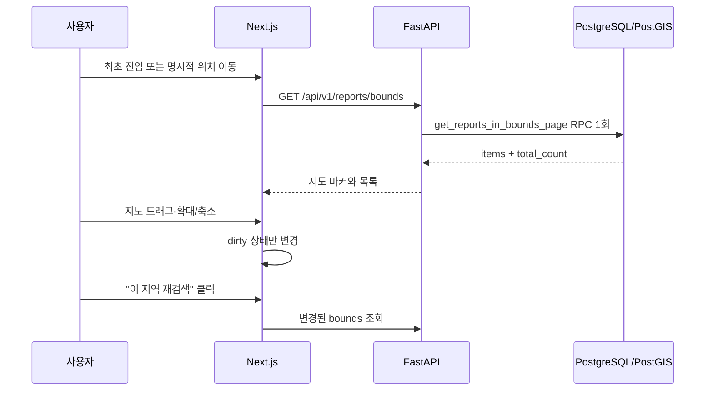

# 동네속닥 (Dongne Sokdak)

_Last verified: 2026-07-24_

사용자가 현재 보고 있는 지도 영역의 생활 정보를 확인하고 제보·투표·댓글로 공유하는 위치 기반 커뮤니티 서비스입니다.

- [서비스 데모](https://dongne-sokdak.vercel.app)
- 1인 개발 · Next.js 16 · TypeScript · FastAPI · Supabase(PostgreSQL/PostGIS) · Kakao Maps
- 포트폴리오 데모의 데이터는 합성 데이터이며, Render 무료 플랜의 콜드 스타트가 발생할 수 있습니다.

## 현재 제품 흐름

지도 화면은 반경 2km/3km 조회가 아니라 **현재 화면의 사각 영역(bounds)** 을 조회합니다.



백엔드에는 이전 반경 조회와 비교 벤치마크 경로가 남아 있지만, 현재 프론트엔드 제품 흐름에서는 사용하지 않습니다.

## 주요 엔지니어링

### 1. 실행계획으로 찾은 bounds 쿼리 병목

페이지와 전체 개수를 각각 조회하던 두 RPC를 하나로 합쳤지만, 20명 동시 부하에서는 p50과 처리량이 개선되지 않았습니다. 네트워크 왕복 횟수만 보고 성능 개선으로 결론 내리지 않고 `EXPLAIN (ANALYZE, BUFFERS)`로 DB 내부를 다시 측정했습니다.

대표 강남 bounds의 공간 후보 8,039건마다 선택 필터 함수가 호출되는 것이 병목이었습니다. 활성 RPC에 category/search 술어를 인라인해 PostgreSQL이 `NULL` 필터를 제거하고 선택도에 맞는 실행계획을 세우도록 바꿨습니다.

| 측정 | 변경 전 | 변경 후 | 결과 |
| --- | ---: | ---: | ---: |
| count SQL | 55.8ms | 6.6ms | 88.2% 감소 |
| 전체 SQL 3회 중앙값 | 125.8ms | 16.0ms | 87.3% 감소 |
| API p50 3회 중앙값 | 8.8초 | 7.6초 | 13.6% 감소 |
| API p99 3회 중앙값 | 21초 | 16초 | 23.8% 감소 |
| 처리량 | 2.09 RPS | 2.40 RPS | 15.0% 증가 |
| 실패율 | 0% | 0% | 동일 |

API 측정은 Locust 2.32.10, 4 workers, 동시 사용자 20명, 90초, 강남 80%/서울 20%의 결정적 bounds 1,000개와 합성 데이터 10,006건으로 전후 각 3회 수행했습니다. 이는 통제된 테스트 환경의 수치이며 운영 트래픽 SLA가 아닙니다.

- [상세 측정 보고서](backend/results/locust/BOUNDS_RPC_BENCHMARK_20260724.md)
- [ADR-0010: 활성 bounds 필터 인라인](docs/adr/0010-inline-active-bounds-filters.md)

### 2. 목록 N+1 제거

게시글마다 투표·댓글 수를 반복 조회하던 `1 + 2N` 구조를 RPC 내부 집계로 바꿨습니다. 목록 조회는 전체 개수 1회, 페이지 1회, 로그인 사용자의 투표 여부 batch 조회 0~1회로 **2~3회**에 끝납니다.

### 3. 지도 요청과 렌더링 비용 제어

- 드래그·확대/축소는 조회 영역을 즉시 커밋하지 않고 dirty 상태만 갱신합니다.
- 테스트에서 지도 조작 20회 동안 bounds 커밋 0회, “이 지역 재검색” 후 1회를 검증합니다.
- 500개 결정적 입력 중 화면 안 80개만 렌더링하는 viewport culling을 테스트합니다.
- 줌 단계에 따라 Kakao 클러스터, 30m 근접 그룹, 개별 마커를 구분합니다.

## 구조

```text
frontend/src/
├── app/                       # 화면 조합
├── features/<slice>/
│   ├── domain/                # 엔티티·포트·유스케이스
│   ├── data/                  # API/Supabase/Kakao 어댑터
│   └── presentation/          # ViewModel 훅·UI
└── shared/                    # 공통 UI와 상태

backend/app/
├── api/                       # 얇은 FastAPI 라우트
├── services/                  # 애플리케이션 로직
├── schemas/                   # Pydantic v2
└── db/                        # Supabase 클라이언트
```

성능이 중요한 지도 조회는 `FastAPI → ReportService → PostgreSQL RPC` 경계로 끝냅니다. DB 접근은 Supabase client로 통일되어 있으며 SQLAlchemy ORM은 사용하지 않습니다.

## 실행과 검증

```bash
# Frontend
cd frontend
npm ci
npm run dev

# Backend
cd backend
python -m venv .venv
pip install -r requirements-dev.txt
uvicorn app.main:app --reload
```

```bash
# Frontend quality gate
cd frontend
npm run lint
npm run tsc:check
npm test -- --run

# Backend quality gate
cd backend
python -m pytest -q
```

백엔드는 `backend/.env.example`을 기준으로 설정합니다. 프론트엔드는 `frontend/.env.local`에 `NEXT_PUBLIC_SUPABASE_URL`, `NEXT_PUBLIC_SUPABASE_ANON_KEY`, `NEXT_PUBLIC_API_URL`, `NEXT_PUBLIC_KAKAO_MAP_API_KEY`를 설정합니다.

## 문서

- [문서 인덱스](docs/README.md)
- [도메인 용어](CONTEXT.md)
- [프론트엔드 아키텍처](docs/FRONTEND_CLEAN_ARCHITECTURE.md)
- [설계 결정 기록](docs/adr/)
- [포트폴리오 요약](docs/portfolio/PORTFOLIO.md)
- [상세 엔지니어링 노트](docs/portfolio/ENGINEERING_NOTES.md)

본 저장소는 포트폴리오 공개용이며 별도 라이선스를 부여하지 않습니다.
