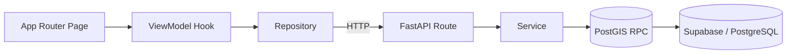

# 동네속닥 (Dongne Sokdak)

> 우리 동네의 불편사항을 지도 위에 제보하고 함께 공감·해결하는 지역 커뮤니티 서비스 — 무거운 공식 민원 채널 대신 가볍고 직관적인 제보 경험을 목표로 합니다.

- 🔗 **Live**: https://dongne-sokdak.vercel.app
  > 포트폴리오 데모입니다. 백엔드가 Render 무료 플랜으로 동작해 첫 요청 시 콜드 스타트(30초~1분)가 발생할 수 있고, 표시되는 제보·댓글은 모두 더미 데이터입니다.

**Stack**: Next.js 16 (App Router) · TypeScript · FastAPI · Supabase (PostgreSQL + PostGIS / Auth / Storage) · Kakao Maps · Vercel + Render

---

## Architecture

프론트엔드와 백엔드 모두 레이어드 아키텍처를 따르며 **의존성은 안쪽으로만 흐릅니다.** 페이지는 ViewModel 훅만 호출하고, 성능이 중요한 경로는 Python이 아니라 PostgreSQL RPC에서 끝냅니다.



- **프론트엔드 — feature 슬라이스별 Clean Architecture**: `domain`(순수 use case) → `data`(repository) → `presentation`(ViewModel 훅 + UI). 페이지는 repository·Supabase를 직접 import하지 않고, Kakao Maps SDK는 데이터 레이어에만 둡니다.
- **백엔드 — service 레이어**: 라우트는 얇게 유지하고 비즈니스 로직은 service가 소유합니다. 무거운 조회는 `supabase/migrations/`의 SQL RPC로 위임합니다.

상세 규칙은 [docs/FRONTEND_CLEAN_ARCHITECTURE.md](docs/FRONTEND_CLEAN_ARCHITECTURE.md) · [CLAUDE.md](CLAUDE.md).

## Performance engineering

이 프로젝트의 핵심은 기능 개수가 아니라 **"지도를 움직일 때마다 발생하는 쿼리·렌더링 병목을 어떻게 측정하고 걷어냈는가"** 입니다.

### 1. 거리 기반 공간 쿼리 최적화 (PostGIS)

데이터가 늘면서 지도 영역 이동 시 응답이 지연됐습니다. 거리 계산을 애플리케이션(Python Haversine 루프)에서 **DB의 GiST 공간 인덱스**로 옮겨, `get_reports_within_radius`를 `&&` 바운딩 박스 1차 필터 → `ST_DWithin` 2차 정밀 필터로 재작성했습니다.

**측정 방법** — Locust로 REST+Python(V1) vs RPC+PostGIS(V3)를 1:1로 비교했습니다. 강남 고밀집 시드 1만 건, Supabase 클라우드, `uvicorn --workers 4`, 각 3분. 동시성을 달리해 두 구간에서 측정했습니다.

**① 동시 20명 — 워커 ≥ 동시성, DB 성능이 드러나는 구간**

| 지표 | V1 (REST+Python) | V3 (RPC+PostGIS) | 개선 |
|---|---|---|---|
| p50 | 1,500 ms | 1,100 ms | **27% ↓** |
| p99 | 4,300 ms | 3,900 ms | 9% ↓ |
| 처리량 | 2.62 RPS | 3.02 RPS | **15% ↑** |
| 실패율 | 0% | 0% | — |

**② 동시 100명 — 포화 구간**

| 지표 | V1 | V3 |
|---|---|---|
| p50 | 13,000 ms | 13,000 ms |
| 최소 응답 | 2,003 ms | **1,172 ms** |
| 처리량 | 3.25 RPS | 3.46 RPS |
| 실패율 | 0% | 0% |

100명 구간에서는 **p50이 동률(13초)로 수렴**합니다. 동시 요청이 워커 풀을 넘어서면 응답 시간의 대부분이 큐 대기가 되어, ms 단위의 DB 쿼리 차이가 초 단위 큐잉에 묻히기 때문입니다. V3의 실제 우위는 **큐에 밀리지 않은 최소 응답(1,172 ms vs 2,003 ms, 41% 빠름)**과 처리량에서만 드러납니다. 즉 이 환경의 병목은 DB가 아니라 **백엔드 동시성**이며, 유효한 쿼리 성능 비교는 20명 구간입니다.

> 위 수치는 모두 `backend/results/locust/`의 Locust CSV 원본에 근거합니다. 초기 단일 워커 측정에서는 큐잉이 전 구간을 평준화시켜 V1/V3 차이가 드러나지 않았고, 워커를 4개로 늘려 셋업을 교정한 뒤 재측정해 위 결과를 얻었습니다.

### 2. RPC 기반 N+1 제거

목록·대시보드 조회가 행마다 추가 쿼리를 날리는 N+1 구조였습니다. 집계를 DB 한 번의 호출로 묶었습니다.

- `get_reports_within_radius` / `get_reports_in_bounds` — 제보 + `vote_count` + `comment_count`를 한 RPC에서 집계 반환 ([20260508_update_spatial_rpcs_with_counts.sql](backend/supabase/migrations/20260508_update_spatial_rpcs_with_counts.sql)).
- `get_admin_dashboard_stats` — 12종 통계(유저/제보/댓글/투표/관리자 활동)를 **단일 호출**의 `json_build_object`로 반환.
- `get_reports_paginated`, `get_profile_with_stats` — 페이지네이션·프로필 통계도 RPC로 일원화.

### 3. 지도 렌더링 구조 최적화

마커 100~500개를 드래그할 때 React 재조정으로 인한 프레임 드랍을 제거했습니다.

- **Strict memoization** — `position={{lat,lng}}` 같은 객체 리터럴/인라인 함수를 primitive prop(`lat=`, `lng=`) + `useCallback`으로 평탄화해 `React.memo` 격리를 복원.
- **Viewport culling** — 화면 밖 마커를 렌더 배열에서 아예 제거(500 → ~80 노드).
- **Concurrent rendering** — 무거운 오버레이 재조정을 `useTransition`으로 저우선 스케줄링해 Kakao 맵 패닝 애니메이션을 막지 않도록.
- **API 스팸 차단** — `center_changed`(프레임마다 발동) 리스너를 제거하고 `dragend`/`zoom_changed`로만 fetch, 이전 좌표와 0.002도(~200m) 미만 이동은 drop해 무한 리페치 루프 차단.

→ [docs/plans/PLAN_marker_rendering_optimization.md](docs/plans/PLAN_marker_rendering_optimization.md)

## Beyond performance

- **인증/보안** — Supabase Auth + 카카오·구글 OAuth2 Code Exchange, JWT, RBAC + RLS, 관리자 활동 로깅. 상세는 [README_SECURITY.md](README_SECURITY.md).
- **관리자 시스템** — 실시간 대시보드, 제보 상태/담당자 관리, 역할 기반 사용자 관리, 활동 로그 CSV 내보내기.
- **테스트** — 프론트 Vitest + RTL(ViewModel·Repository ≥80% Lines), 백엔드 pytest(서비스 단위 + 통합).

## Quick start

```bash
# Frontend
cd frontend
cp .env.example .env.local        # Supabase / Kakao / API URL 채우기
npm install && npm run dev        # http://localhost:3000

# Backend
cd backend
python -m venv .venv && source .venv/bin/activate
pip install -r requirements.txt
uvicorn app.main:app --reload     # http://localhost:8000 (docs: /docs)
```

**필수 환경 변수** — 프론트: `NEXT_PUBLIC_SUPABASE_URL`, `NEXT_PUBLIC_SUPABASE_ANON_KEY`, `NEXT_PUBLIC_API_URL`, `NEXT_PUBLIC_KAKAO_MAP_API_KEY`, `NEXT_PUBLIC_KAKAO_REST_API_KEY` / 백엔드: `DATABASE_URL`, `SUPABASE_URL`, `SUPABASE_KEY`, `JWT_SECRET`, `CORS_ORIGINS`, 카카오·구글 OAuth 자격 증명.

```bash
# 품질 게이트
cd frontend && npm run lint && npm run tsc:check && npm test -- --run
cd backend  && python -m pytest -q
```

---

> 본 저장소는 **포트폴리오 공개용**이며 별도 라이선스를 부여하지 않습니다 (All Rights Reserved). 코드 열람은 자유로우나 복제·재배포·상업적 사용은 금지합니다.
