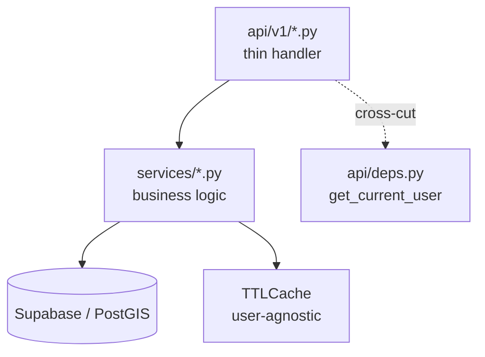

# PLAN — Backend Refactoring & Performance

> **CRITICAL INSTRUCTIONS**: After completing each phase:
> 1. ✅ Check off completed task checkboxes
> 2. 🧪 Run all quality gate validation commands below the phase
> 3. ⚠️ Verify ALL quality gate items pass
> 4. 📅 Update "Last Updated" date
> 5. 📝 Document learnings in Notes section
> 6. ➡️ Only then proceed to next phase
>
> ⛔ DO NOT skip quality gates or proceed with failing checks

- **Created**: 2026-05-06
- **Last Updated**: 2026-05-06
- **Owner**: sungheeyoon
- **Scope**: Medium (2 phases, 5–7h)
- **Companion**: `PLAN_frontend_refactor_perf.md`

---

## 1. Overview

CLAUDE.md 명세는 *"`api/v1/` 라우트 핸들러는 thin, 비즈니스 로직은 `services/` 로 위임"* 이지만 현실은:

- `backend/app/services/__init__.py` 만 존재 (파일 1개) — 실질적으로 **빈 디렉토리**
- 모든 비즈니스 로직이 라우트 파일에 인라인 (특히 `api/admin/routes.py` 1171줄)
- `api/v1/reports.py:79-89` `enrich_report_data` 의 **`vote_count`/`comment_count` 가 하드코딩 `0`** — `/reports` 리스트가 잘못된 카운트를 반환 (N+1 회피용 임시 조치가 운영에 그대로 남음)
- 백엔드 인메모리 `TTLCache(15s)` 키에 `current_user_id` 가 포함 — 사용자별 캐시 폭증, 멀티 인스턴스 시 캐시 hit-rate 저하

**목표**
1. `services/` 레이어 신설로 라우트 thin 화 + 단위 테스트 가능 구조
2. `admin/routes.py` 1171줄 → 도메인별 4개 파일로 분리
3. `/reports` 리스트의 N+1 영구 해결 (RPC 또는 SQL view)
4. 캐시 정책 정리 — user-agnostic 캐시 + 사용자별 voted 정보는 별도 lookup

**비목표**
- DB 스키마 마이그레이션 변경 없음 (RPC 추가만)
- 인증/권한 정책 변경 없음

---

## 2. Context Map

### 핵심 파일
| 파일 | 라인 | 역할 | 변경 |
|---|---|---|---|
| `backend/app/api/admin/routes.py` | 1171 | 어드민 모든 엔드포인트 | 4개로 분할 |
| `backend/app/api/v1/reports.py` | 476 | 제보 CRUD/검색 | 비즈니스 로직 services 로 이전, N+1 fix |
| `backend/app/api/v1/comments.py` | 278 | 댓글 | 동상 |
| `backend/app/api/v1/votes.py` | 170 | 공감 | 동상 |
| `backend/app/api/v1/profiles.py` | 281 | 프로필 | 동상 |
| `backend/app/services/__init__.py` | 1 | (빈 모듈) | 신규 모듈들 추가 |
| `backend/supabase/migrations/20260205_consolidated_schema.sql` | — | DB 스키마 | RPC 추가 마이그레이션 신규 작성 |

### 신규 파일 (Phase 1)
- `backend/app/services/admin_service.py`
- `backend/app/services/report_service.py`
- `backend/app/services/comment_service.py`
- `backend/app/services/vote_service.py`
- `backend/app/services/profile_service.py`
- `backend/app/api/admin/routes_dashboard.py`
- `backend/app/api/admin/routes_users.py`
- `backend/app/api/admin/routes_reports.py`
- `backend/app/api/admin/routes_settings.py`

### 신규 파일 (Phase 2)
- `backend/supabase/migrations/20260507_get_reports_paginated.sql` (RPC)
- `backend/tests/conftest.py`, `backend/tests/test_report_service.py`

### Layer 구조 (목표)



---

## 3. Architecture Decisions

| 결정 | 근거 |
|---|---|
| services/ 함수 시그니처는 `(supabase: Client, ...)` 명시 | DI 명시 → 테스트에서 mock client 주입 용이 |
| 캐시 키에서 `current_user_id` 제거, voted 정보는 별도 batch lookup | 캐시 hit-rate 향상, 사용자수 × 좌표수 폭발 방지 |
| `admin/routes.py` 분리 시 `prefix="/admin"` 은 `api/admin/__init__.py` 라우터 합본에서 1회만 | 외부 URL 변경 없음 |
| `/reports` 리스트도 RPC `get_reports_paginated` 로 통일 | `/nearby`, `/bounds` 와 동일 경로 → vote/comment count 일관성 보장 |
| 테스트는 pytest + `pytest-asyncio` + supabase mock | 백엔드 첫 테스트 인프라. PostGIS 실호출은 통합 테스트 1-2개만 |

---

## 4. Phase Breakdown

### Phase 1 — services 레이어 도입 + admin routes 분리 (3-4h)

**Goal**: 라우트 thin 화, `admin/routes.py` 1171줄 → 4 파일 (각 <400줄), 첫 단위 테스트 도입

**Context Map**: 위 표의 `api/v1/*` 와 `services/*`

**Test Strategy**
- `pytest` + `pytest-asyncio` + `pytest-mock` 셋업
- `report_service.create_report()` 단위 테스트 — supabase client mock
- Coverage target: 새로 만든 service 함수 ≥80%
- 통합 테스트는 Phase 2 까지 제외 (라우트 분리만으로는 동작 변경 없음)

**Sub-Phase 1A — services 모듈 생성 + v1 라우트 위임**
- [ ] **RED**: `backend/tests/test_report_service.py` — `create_report` / `parse_location` / 실패 케이스 (실패)
- [ ] **GREEN**: `services/report_service.py` 신설. `api/v1/reports.py` 의 `parse_location`, `enrich_report_data`, CRUD 헬퍼를 이전. 라우트는 `service.create_report(...)` 같은 thin 위임만 남김.
- [ ] **GREEN**: 동일 패턴으로 `comment_service`, `vote_service`, `profile_service`
- [ ] **GREEN**: `pytest -q` 그린

**Sub-Phase 1B — admin routes 분리**
- [ ] **GREEN**: `services/admin_service.py` 에 통계/사용자/제보관리/설정 로직 이전
- [ ] **GREEN**: `api/admin/routes_dashboard.py` (`/dashboard/*`)
- [ ] **GREEN**: `api/admin/routes_users.py` (`/users`, `/users/{id}/role`, `/users/bulk`)
- [ ] **GREEN**: `api/admin/routes_reports.py` (`/reports`, `/reports/{id}/status`, `/reports/{id}/action`)
- [ ] **GREEN**: `api/admin/routes_settings.py` (`/settings`, `/activities`, `/my-info`)
- [ ] **GREEN**: `api/admin/__init__.py` 에서 4개 라우터 include — 외부 URL 변경 X
- [ ] **REFACTOR**: 빈 `api/admin/routes.py` 삭제

**Quality Gate**
```bash
cd backend
# 부팅 OK
.venv/Scripts/python -c "from app.main import app; print('boot OK')"
# 테스트
.venv/Scripts/python -m pytest -q
# coverage (Phase 신규분만)
.venv/Scripts/python -m pytest --cov=app/services --cov-report=term-missing
# 라인 카운트 회귀 검사
wc -l app/api/admin/routes_*.py
# 각 파일 <400줄 확인
# 외부 라우트 동등성 (수동/스크립트)
.venv/Scripts/python -c "
from app.main import app
paths = sorted([r.path for r in app.routes])
expected_admin = ['/admin/dashboard/stats','/admin/users','/admin/reports','/admin/settings']
for p in expected_admin: assert any(x.startswith(p) for x in paths), f'missing {p}'
print('routes OK')
"
```

**Rollback**
- 1A, 1B 별도 커밋. 회귀 시 sub-phase 단위 revert.
- DB 변경 없음 → 코드 revert 만으로 완전 복구.

---

### Phase 2 — N+1 영구 해결 + 캐시 정리 (2-3h)

**Goal**: `/reports` 리스트의 vote/comment count 정확화, 캐시 hit-rate 향상

**Context Map**:
- `backend/app/services/report_service.py` (Phase 1 산출물)
- `backend/supabase/migrations/20260205_consolidated_schema.sql` (참고)
- 신규 `backend/supabase/migrations/20260507_get_reports_paginated.sql`

**Test Strategy**
- 통합 테스트 1개: 100건 시드 → `/reports?limit=100` 응답 시간 < 1s, 모든 항목 vote_count/comment_count 가 0이 아닌 정수 (실제 DB 카운트와 매치)
- 단위 테스트: 캐시키 정규화 함수 (user_id 미포함 검증)
- Coverage target: report_service 90%

**Tasks**
- [ ] **RED**: `backend/tests/test_reports_endpoint.py::test_list_reports_has_real_counts` (실패: 현재 0 반환)
- [ ] **GREEN**: SQL RPC `get_reports_paginated(category, status, user_id, search, page, limit)` 작성 — `/nearby`, `/bounds` 의 vote/comment count 조인 패턴 재사용. 마이그레이션 파일로 추가.
- [ ] **GREEN**: `report_service.list_reports()` 가 RPC 호출하도록 전환. `enrich_report_data` 의 하드코딩 `0` 제거.
- [ ] **GREEN**: 통합 테스트 그린 (시드 100건)
- [ ] **REFACTOR**: 캐시 키에서 `current_user_id` 제거. user-agnostic payload 캐싱.
- [ ] **REFACTOR**: 사용자별 `user_voted` 는 응답 직전 단일 쿼리(`votes WHERE user_id = ? AND report_id IN (...)`)로 batch 조회 후 합성.
- [ ] **REFACTOR**: `nearby_cache`, `bounds_cache` 의 `maxsize=1000` 적정성 재평가 — 메모리 사용량 측정 후 결정.
- [ ] **REFACTOR**: `api/v1/reports.py` 의 `print(...)` 제거 → `app.core.logging` 의 logger 사용

**Quality Gate**
```bash
cd backend
# 마이그레이션 적용 가능 여부
ls supabase/migrations/20260507_get_reports_paginated.sql
# 부팅
.venv/Scripts/python -c "from app.main import app; print('boot OK')"
# 단위 + 통합
.venv/Scripts/python -m pytest -q
.venv/Scripts/python -m pytest --cov=app/services/report_service --cov-report=term-missing
# 부하 sanity (옵션, staging 에서)
# ab -n 100 -c 10 http://localhost:8000/api/v1/reports?limit=100
# 평균 응답 < 500ms 목표
```

**Rollback**
- 마이그레이션은 신규 RPC 추가만 → 기존 데이터 영향 없음. revert 시 `DROP FUNCTION get_reports_paginated`.
- 코드 revert 시 캐시 키 원복 → 즉시 이전 동작.

---

## 5. Risk Assessment

| 위험 | 확률 | 영향 | 완화 |
|---|---|---|---|
| services 이전 시 의존 경로(deps.py, security.py) 누락 | M | M | 단계별 단위 테스트로 immediate catch |
| admin 라우트 분리 후 기존 경로 충돌 (예: `/admin/users` vs `/admin/users/{id}`) | M | H | `app.routes` 덤프 비교 자동화 (quality gate 스크립트) |
| RPC 추가 시 PostgreSQL function signature 충돌 | L | M | 새 함수명 `get_reports_paginated` 사용. 기존 `get_reports_within_radius` 와 별개. |
| 캐시 키 변경 후 기존 캐시 stale 응답 | L | L | 인메모리 캐시이므로 재시작 시 자동 클리어 |
| user_voted batch lookup 추가 비용 | L | M | 100건 IN 쿼리는 PostGIS index 로 < 50ms. 측정으로 검증. |

---

## 6. Rollback Strategy

| Phase | 단위 | 복구 |
|---|---|---|
| 1A | 단일 커밋 | `git revert <hash>` |
| 1B | 단일 커밋 | `git revert <hash>` |
| 2 | 코드 + 마이그레이션 분리 커밋 | 코드 revert + `DROP FUNCTION get_reports_paginated;` |

---

## 7. Progress Tracking

- [ ] Phase 1A — v1 services 도입
  - [ ] Quality gate 통과
- [ ] Phase 1B — admin routes 분리
  - [ ] Quality gate 통과
  - [ ] `routes_*.py` 각 <400줄 확인
- [ ] Phase 2 — N+1 fix + 캐시 정리
  - [ ] RPC 마이그레이션 파일 추가
  - [ ] `/reports` 응답 vote/comment count 실측 정확
  - [ ] 캐시 키에서 user_id 제거
  - [ ] Quality gate 통과

---

## 8. Notes & Learnings

> 각 phase 완료 시 아래에 5줄 이내로 학습/이슈 기록

- (Phase 1A) —
- (Phase 1B) —
- (Phase 2) —
