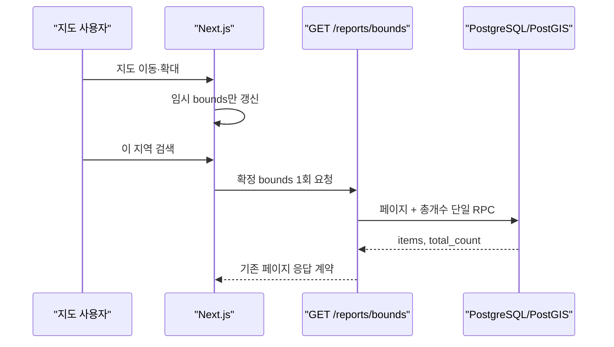

# Bounds Query Reinforcement Plan

> **CRITICAL INSTRUCTIONS**: After completing each phase:
> 1. ✅ Check off completed task checkboxes
> 2. 🧪 Run all quality gate validation commands
> 3. ⚠️ Verify ALL quality gate items pass
> 4. 📅 Update "Last Updated" date
> 5. 📝 Document learnings in Notes section
> 6. ➡️ Only then proceed to next phase
>
> ⛔ DO NOT skip quality gates or proceed with failing checks

- Status: Complete — controlled pre/post three-run measurement verified
- Created: 2026-07-24
- Last Updated: 2026-07-24
- Scope: 현재 프론트엔드가 사용하는 `bounds` 조회 경로의 테스트·측정·작은 성능 개선
- Out of Scope: `nearby` 제거, 기존 문서 정리, 포트폴리오·자기소개서 수정, 운영 배포

## Overview

지도 화면의 실제 조회 경로인 `/api/v1/reports/bounds`를 기준으로 성능 계약과 사용자 상호작용 회귀 테스트를 보강한다. 목록과 총개수 조회에 사용하던 두 번의 DB RPC를 한 번으로 합치되 HTTP 응답 계약은 유지한다. 이후 동일 조건을 재현할 수 있는 bounds 전용 부하 테스트 도구와 자동 품질 검사를 추가한다.

## Objectives

- bounds 요청당 DB RPC를 2회에서 1회로 줄인다.
- 지도 이동·확대 이벤트가 즉시 API 재호출을 발생시키지 않는다는 회귀 테스트를 추가한다.
- 500개 마커 입력에서도 화면 밖 마커가 렌더링되지 않는다는 결정적 테스트를 추가한다.
- bounds 성능을 동일 조건으로 다시 측정할 수 있는 Locust 시나리오를 만든다.
- 프론트엔드와 백엔드 테스트를 CI에서 반복 실행할 수 있게 한다.

## Context Map

| 역할 | 경로 |
| --- | --- |
| HTTP 응답 계약 | `backend/app/api/v1/endpoints/reports.py` |
| bounds 애플리케이션 로직 | `backend/app/services/report_service.py` |
| 공간 쿼리 파라미터 | `backend/app/schemas/spatial_query.py` |
| DB RPC 정의 | `backend/supabase/migrations/` |
| 백엔드 서비스 테스트 | `backend/tests/test_report_service.py` |
| 백엔드 엔드포인트 테스트 | `backend/tests/test_reports_endpoint.py` |
| 지도 bounds 커밋 훅 | `frontend/src/features/map/presentation/hooks/useKakaoMapBounds.ts` |
| 지도 bounds 훅 테스트 | `frontend/__tests__/features/map/useKakaoMapBounds.test.ts` |
| 마커 렌더링 계층 | `frontend/src/features/map/presentation/components/MapMarkerLayer.tsx` |
| 마커 회귀 테스트 | `frontend/__tests__/features/map/MapMarkerLayer.test.tsx` |
| 부하 테스트 | `backend/scripts/` |

## Data Flow



## Architecture Decisions

1. 프론트엔드가 실제 사용하는 `bounds`만 이번 작업의 성능 기준으로 삼는다.
2. HTTP 응답 스키마는 바꾸지 않고 DB 왕복만 줄여 회귀 위험을 제한한다.
3. DB RPC 성능은 외부 경계이므로 서비스 테스트에서 RPC 호출 횟수와 반환 매핑을 성능 계약으로 검증한다.
4. 지도 이벤트 테스트는 내부 구현 대신 `bounds 조회 커밋 횟수`라는 관찰 가능한 동작을 검증한다.
5. 기존 nearby 경로와 문서는 이번 단계에서 삭제하지 않는다.

## Phase 1 — Bounds DB Round-Trip Contract

**Goal:** 한 번의 bounds 요청이 DB RPC 한 번으로 페이지 데이터와 전체 개수를 얻는다.

**Context Map:** `backend/tests/test_report_service.py`, `backend/app/services/report_service.py`, `backend/supabase/migrations/`

**Test Strategy**

- Test file: `backend/tests/test_report_service.py`
- Scenario: 캐시 미스인 bounds 조회에서 RPC가 한 번만 호출되고 기존 응답 형식을 유지한다.
- Expected RED: 현재 구현은 count와 page RPC를 각각 호출한다.
- Coverage target: 변경된 bounds 서비스 분기 90% 이상
- Mock boundary: Supabase RPC 클라이언트

**Tasks**

- [x] RED: 단일 DB RPC 성능 계약 테스트를 작성하고 기존 구현에서 실패를 확인한다.
- [x] GREEN: 페이지와 총개수를 함께 반환하는 PostGIS RPC migration을 추가한다.
- [x] GREEN: `ReportService`가 신규 RPC 결과를 기존 응답으로 매핑하게 한다.
- [x] REFACTOR: 중복 파라미터·응답 처리 코드를 정리한다.

**Quality Gate**

```powershell
python -m pytest backend/tests/test_report_service.py backend/tests/test_reports_endpoint.py -q
```

- [x] 신규 테스트 통과
- [x] 기존 bounds HTTP 응답 계약 유지
- [x] 캐시·사용자 투표 오버레이 회귀 없음

**Rollback:** 신규 migration은 독립 함수 추가이므로 서비스 호출을 기존 두 RPC로 되돌릴 수 있다.

## Phase 2 — Map Interaction and Rendering Evidence

**Goal:** 불필요한 네트워크 재조회 억제와 대량 마커 화면 밖 제거를 테스트 수치로 남긴다.

**Context Map:** `frontend/__tests__/features/map/useKakaoMapBounds.test.ts`, `frontend/__tests__/features/map/MapMarkerLayer.test.tsx`

**Test Strategy**

- 20회의 drag/zoom 이벤트 후 자동 bounds 커밋 0회, 명시적 검색 후 1회를 검증한다.
- 결정적으로 생성한 500개 신고 중 화면 내부 데이터만 렌더링되는지 검증한다.
- 테스트 데이터는 난수를 사용하지 않는다.

**Tasks**

- [x] RED: 연속 지도 조작과 명시적 커밋 시나리오를 추가한다.
- [x] GREEN: 기존 이벤트 조절 로직이 계약을 충족함을 확인해 런타임 수정 없이 유지한다.
- [x] RED: 500개 마커 viewport culling 시나리오를 추가한다.
- [x] GREEN: 기존 culling 로직이 계약을 충족함을 확인해 런타임 수정 없이 유지한다.
- [x] REFACTOR: 테스트 픽스처에서 난수를 제거하고 결정적으로 정리한다.

**Quality Gate**

```powershell
cd frontend
npm.cmd test -- --run
npm.cmd run lint
npx.cmd tsc --noEmit
```

- [x] 전체 프론트엔드 테스트 통과
- [x] 지도 조작 20회 동안 자동 bounds 조회 0회
- [x] 명시적 검색 시 bounds 조회 1회
- [x] 500개 입력의 viewport culling 검증

**Rollback:** 신규 테스트만 제거하면 되며 제품 동작 변경이 없으면 런타임 롤백은 필요 없다.

## Phase 3 — Reproducible Measurement and CI

**Goal:** 활성 bounds 경로를 다시 측정하고 모든 회귀 테스트를 반복 실행할 수 있다.

**Context Map:** `backend/scripts/`, `backend/requirements-dev.txt`, `.github/workflows/`

**Test Strategy**

- 고정된 서울 지역 bounds 세트로 동일한 API 경로와 파라미터를 반복한다.
- Locust CSV를 표준 라이브러리 스크립트로 요약해 p50, p99, RPS, 실패율을 비교한다.
- CI에서 프론트엔드 lint/type/test와 백엔드 pytest를 실행한다.

**Tasks**

- [x] RED: 기존 부하 테스트가 active bounds 전용 시나리오를 제공하지 않음을 확인한다.
- [x] GREEN: deterministic bounds Locust 시나리오를 추가한다.
- [x] GREEN: before/after CSV 요약 도구를 추가한다.
- [x] GREEN: 개발용 Python 의존성과 GitHub Actions 품질 게이트를 추가한다.
- [x] REFACTOR: 로컬·CI 명령을 같은 진입점으로 정리한다.

**Quality Gate**

```powershell
python backend/scripts/summarize_bounds_benchmark.py --help
python -m pytest backend/tests -q
cd frontend
npm.cmd test -- --run
npm.cmd run lint
npx.cmd tsc --noEmit
```

- [x] 측정 조건이 코드에 고정되어 재현 가능
- [x] CSV 요약 결과가 p50, p99, RPS, 실패율을 포함
- [x] CI 설정 문법과 명령이 로컬 프로젝트 구조와 일치

**Rollback:** 측정 스크립트·개발 의존성·CI 파일은 런타임과 독립적이므로 각각 제거할 수 있다.

## Risk Assessment

| Risk | Probability | Impact | Mitigation |
| --- | --- | --- | --- |
| 신규 RPC migration보다 앱 코드가 먼저 배포됨 | Medium | High | DB migration 선적용을 배포 전제조건으로 명시 |
| 단일 RPC가 대량 결과를 불필요하게 물질화함 | Medium | Medium | 페이지 행에서만 집계하고 필터 집합의 count는 별도 계획 가능하게 SQL 구성 |
| 캐시가 DB 성능 차이를 가림 | High | Medium | 동일한 고정 데이터·동일한 캐시 상태로 전후 비교하고 결과에 조건 명시 |
| 로컬 Python 가상환경이 깨져 백엔드 테스트를 실행하지 못함 | High | Medium | 의존성 파일과 CI를 보강하고, 가능한 런타임을 별도 확인 |

## Progress

- [x] Phase 1 complete
- [x] Phase 2 complete
- [x] Phase 3 complete
- [x] Live PostGIS migration applied
- [x] Live RPC and deployed API smoke tests complete
- [x] 4-worker bounds benchmark complete
- [x] Live execution plan captured and optional-filter bottleneck identified
- [x] Inline-filter migration applied and three post-change runs completed
- [x] Same-version pre-inline benchmark isolated and repeated three times
- [x] Temporary benchmark RPC removed and absence verified
- [x] All quality gates complete

## Notes & Learnings

- 필수 템플릿인 `.gemini/rules/plan-template-v2.md`가 저장소에 없어 AGENTS.md의 요구 항목을 직접 반영해 작성했다.
- 이번 작업의 기준 경로는 프론트엔드가 현재 사용하는 `bounds`이며 `nearby`는 후속 정리 대상으로 남긴다.
- RED 확인: 신규 단일 RPC 테스트만 실패하고 기존 서비스 테스트 31개는 통과했다.
- GREEN 확인: 백엔드 146개, 프론트엔드 165개 테스트와 lint, typecheck, production build가 통과했다.
- 2026-07-24 migration 적용 완료. 신규 RPC와 배포 API 모두 `total_count=9,298`로 응답했다.
- 실측 시점 전체 reports는 10,006건이었다.
- 4 workers / 20 users / 90초 / 고유 bounds 조건에서 2 RPC 대비 1 RPC 결과는 p50 -1.1%, p99 +10.5%, RPS -1.9%, 실패율 0%였다.
- 저부하 직접 RPC 15회 교차 측정에서는 p50 -44.1%, p90 -18.9%였지만 사용자 API 부하 성능 수치로 사용하지 않는다.
- 최초 `2 RPC → 1 RPC` 비교만으로는 동시 부하 개선을 입증하지 못해 성능 품질 게이트를 보류했고, 이후 실행계획 기반 필터 인라인 후속 측정을 진행했다.
- 실행계획에서 `report_matches_filters`가 공간 후보 8,039건마다 호출되어 count 55.8ms를 사용했고, 동등한 인라인 술어는 6.6ms였다.
- 전체 SQL 3회 중앙값은 125.8ms에서 16.0ms로 87.3% 감소했다.
- Locust 2.32.10 동일 조건에서 pre-inline과 post-inline을 각각 3회 측정했다. 중앙값은 p50 8.8초 → 7.6초(-13.6%), p99 21초 → 16초(-23.8%), 평균 8.835초 → 7.614초(-13.8%), RPS 2.09 → 2.40(+15.0%)였고 실패율은 양쪽 모두 0%였다.
- 운영 RPC의 category/search smoke 검증에서 반환된 모든 항목이 요청 필터를 충족했다.
- pre-inline 재현은 동일 응답 계약을 확인한 임시 RPC와 로컬 서비스 주입으로 격리해 활성 RPC를 되돌리지 않았다. 측정 후 임시 RPC를 삭제하고 함수 부재까지 확인했다.
- 위 변화율은 결정적 합성 데이터와 공유 Supabase 환경을 사용한 통제 부하 테스트 결과이며 운영 트래픽 지연이나 SLA 수치로 해석하지 않는다.
