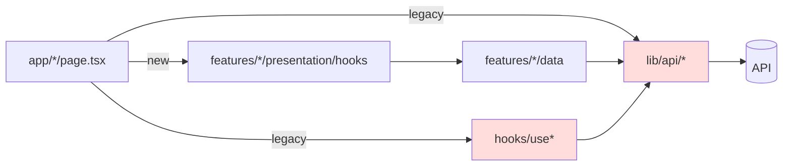
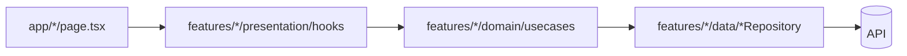

# PLAN — Frontend Refactoring & Performance

> **CRITICAL INSTRUCTIONS**: After completing each phase:
> 1. ✅ Check off completed task checkboxes
> 2. 🧪 Run all quality gate validation commands below the phase
> 3. ⚠️ Verify ALL quality gate items pass
> 4. 📅 Update "Last Updated" date
> 5. 📝 Document learnings in Notes section
> 6. ➡️ Only then proceed to next phase
>
> ⛔ DO NOT skip quality gates or proceed with failing checks

- **Created**: 2026-05-06
- **Last Updated**: 2026-05-07 (1차 리뷰 — 보완 항목 식별)
- **Owner**: sungheeyoon
- **Scope**: Medium (3 phases, 8–11h)
- **Companion**: `PLAN_backend_refactor_perf.md`

---

## 1. Overview

`reports` 피처는 Clean Architecture(`domain → data → presentation`)로 마이그레이션되었으나 **레거시 잔재가 공존**하고 있다.

- 사용처가 0인 hooks/UI 모듈이 빌드 산출물에 포함되어 번들 크기를 늘림
- Admin 페이지는 절반(메인)이 ViewModel을 쓰고 절반(users/settings/reports)이 레거시 `useAdmin`/`useReportManagement` 를 씀 — 이중 구현
- 데이터 레이어가 두 갈래(`lib/api/*` ↔ `features/*/data/*`)로 흩어져 신규 기능 추가 시 어느 쪽에 두어야 할지 혼란
- `MapComponent.tsx` 603줄, `console.log` 132개, 운영 경로에 `DebugClusterer` 래퍼가 들어 있음

**목표**
1. Dead code / 디버그 코드 제거 → 번들 축소·운영 노이즈 제거
2. 레거시 → Clean Architecture 단일화 → 신규 기능 위치 모호성 해소
3. `MapComponent` 책임 분해 → 유지보수성 + 마운트 비용 절감
4. 테스트 인프라(Vitest + RTL) 도입 → 회귀 방지

**비목표**
- 시각적 디자인 변경 없음 (UI 동작 동일)
- 백엔드 변경은 `PLAN_backend_refactor_perf.md` 에서 다룸

---

## 2. Context Map

### 제거/이동 대상
| 파일 | 라인 | 상태 | 처리 |
|---|---|---|---|
| `frontend/src/hooks/useReports.ts` | 124 | import 0 | 삭제 |
| `frontend/src/hooks/useNeighborhoodReports.ts` | 47 | import 0 | 삭제 |
| `frontend/src/hooks/useNeighborhoodFilter.ts` | 242 | import 0 | 삭제 |
| `frontend/src/shared/ui/AppHeader.tsx` | 526 | re-export만 | 삭제 |
| `frontend/src/shared/ui/Navbar.tsx` | 243 | 미사용 | 삭제 |
| `frontend/src/shared/ui/HeroSection.tsx` | 143 | re-export만 | 삭제 |
| `frontend/src/shared/ui/demo/UIShowcase.tsx` | 508 | `/components` 데모 라우트 전용 | dev 가드 또는 삭제 |
| `frontend/src/shared/ui/demo/OriginalAuthModal.tsx` | 204 | 동상 | 동일 |
| `frontend/src/shared/ui/demo/DemoData.ts` | — | 동상 | 동일 |
| `frontend/src/components/ImageUploadDebug.tsx` | — | 디버그 | 삭제 |
| `frontend/src/components/debug/MapDebugPanel.tsx` | — | 디버그 | 삭제 |
| `frontend/src/lib/utils/environmentTest.ts` | — | dev 헬퍼 | dev 가드 |
| `frontend/src/components/MapComponent.tsx:68-75` | — | `DebugClusterer` | 인라인 제거 → `MarkerClusterer` 직접 사용 |

### 수정 대상
| 파일 | 변경 |
|---|---|
| `frontend/src/hooks/useAdmin.ts` (270L) | `features/admin/presentation/hooks/useAdminViewModel.ts` 로 흡수 후 삭제 |
| `frontend/src/hooks/useReportManagement.ts` (278L) | `features/admin/presentation/hooks/useReportManagementViewModel.ts` 로 이전 |
| `frontend/src/app/admin/users/page.tsx` | `useAdmin` → `useAdminViewModel` |
| `frontend/src/app/admin/settings/page.tsx` | 동상 |
| `frontend/src/app/admin/reports/page.tsx` | 동상 |
| `frontend/src/components/admin/ReportDetailModal.tsx` | `useReportManagement` import 경로 갱신 |
| `frontend/src/components/admin/ReportManagement.tsx` | 동상 |
| `frontend/src/lib/api/reports.ts` (249L) | `features/reports/data/apiReportRepository.ts` 내부로 흡수 |
| `frontend/src/lib/api/comments.ts` | `features/reports/data/apiCommentRepository.ts` 로 흡수 |
| `frontend/src/lib/api/votes.ts` | `features/reports/data/apiVoteRepository.ts` 로 흡수 |
| `frontend/src/app/reports/[id]/page.tsx` | `lib/api/reports` → repository 경유 ViewModel 사용 |
| `frontend/src/app/my-reports/page.tsx` | 동상 |
| `frontend/src/components/MapComponent.tsx` (603L) | 3-4 모듈로 분해 (Phase 3) |

### 현재 의존도



### 목표 의존도 (Phase 2 완료 후)



---

## 3. Architecture Decisions

| 결정 | 근거 |
|---|---|
| `lib/api/*` 의 fetch 함수를 repository 내부로 흡수 | 데이터 접근 경로를 1개로 단일화. 외부 import 면이 좁아져 변경 영향 분석이 쉬워짐. |
| Admin도 `features/admin` 슬라이스로 통합 | 메인 어드민 페이지가 이미 `useAdminViewModel` 사용 중. 일관성. |
| `MapComponent`는 3 파일로만 분해 (과분할 금지) | 600줄 단일 파일 → `MapComponent`(루트), `useKakaoMapBounds`(훅), `MapMarkerLayer`(클러스터+마커) |
| Vitest 채택 (Jest 아님) | Next.js 16 / Vite-style ESM 친화. RTL과 호환. |
| 데모 페이지 `/components` 는 환경 변수 가드 후 유지 | 디자인 시스템 카탈로그로 가치 있음. `NEXT_PUBLIC_ENABLE_DEMO_ROUTES === 'true'` 일 때만 라우트 등록. |

---

## 4. Phase Breakdown

### Phase 1 — Dead Code 제거 + 테스트 인프라 도입 (2-3h)

**Goal**: 미사용 모듈 일괄 제거, 운영 디버그 코드 격리, Vitest+RTL 셋업

**Context Map**: 위 "제거 대상" 표 + `frontend/package.json`, `frontend/vitest.config.ts`(신규)

**Test Strategy**
- Vitest + @testing-library/react + jsdom 환경 셋업
- 첫 테스트로 `formatToAdministrativeAddress`, `isValidReportCoordinate` 등 lib/utils 순수 함수에 대한 단위 테스트 3-5개 (smoke)
- Coverage target: 이번 phase 자체는 5% 미만이어도 OK (인프라 도입이 목적)

**Tasks**
- [x] **RED**: `frontend/__tests__/lib/utils/addressUtils.test.ts` 작성 (실패 확인)
- [x] **GREEN**: Vitest 설정 (`vitest.config.ts`, `tsconfig` paths 인식, jsdom)
- [x] **GREEN**: `package.json` 에 `"test": "vitest"`, `"test:coverage": "vitest --coverage"` 추가
- [x] **GREEN**: 실행 → 테스트 그린
- [x] **REFACTOR**: 위 표의 미사용 파일 7개 일괄 삭제
- [x] **REFACTOR**: `shared/ui/index.ts` 에서 삭제된 컴포넌트 export 제거
- [x] **REFACTOR**: `MapComponent.tsx:68-75` `DebugClusterer` 제거 → `MarkerClusterer` 직접 사용 (`:571` `:596`)
- [x] **REFACTOR**: `console.log` 일괄 정리. `process.env.NODE_ENV === 'development'` 가드를 적용하거나 `debug` 모듈 도입. 132건 → 0건 (production)
  - ⚠️ 잔존: `src/lib/utils/environmentTest.ts:9` `:19` 가드 누락 (혼합 처리됨), `src/shared/ui/demo/UIShowcase.tsx` 4건 (데모 라우트라 허용 가능 — 정책 결정 필요)
- [x] **REFACTOR**: `app/components/page.tsx` 를 `process.env.NEXT_PUBLIC_ENABLE_DEMO_ROUTES` 로 가드. 미가드 시 `notFound()`
- [x] **REFACTOR (보완)**: `src/lib/utils/environmentTest.ts` 처리 — 사용처 0이므로 dev 가드 대신 **삭제** 권장. 잔존 시 dev 가드를 모든 라인에 통일
- [x] **REFACTOR (보완)**: `frontend/clean_logs.js` 일회성 스크립트 제거 또는 `scripts/` 로 이동 (저장소 루트에 임시 파일이 남아 있음)

**Quality Gate**
```bash
cd frontend
npm run lint
npm run tsc:check
npm run build
npm run test
# Production console.log 카운트 확인
node -e "const fs=require('fs');const path=require('path');function w(d){for(const f of fs.readdirSync(d)){const p=path.join(d,f);const s=fs.statSync(p);if(s.isDirectory())w(p);else if(/\.(ts|tsx)$/.test(p)){const c=fs.readFileSync(p,'utf8');const lines=c.split('\n');lines.forEach((l,i)=>{if(/^\s*console\.log/.test(l)&&!/NODE_ENV/.test(l))console.log(p+':'+(i+1)+': '+l.trim())})}}}w('src')" | wc -l
# 0이어야 통과
```

**Rollback**
- 단일 커밋으로 묶고, 회귀 발생 시 `git revert <hash>`. 모든 삭제 파일이 `git log` 에 남아 있어야 함.

---

### Phase 2 — 레거시 hooks/lib API → Clean Architecture 흡수 (4-5h)

**Goal**: `hooks/use*` 와 `lib/api/*` 를 `features/*/(data|presentation)` 로 단일화

**Context Map**: 위 "수정 대상" 표

**Test Strategy**
- ViewModel hook 단위 테스트: `useAdminViewModel`, `useReportManagementViewModel`, `useReportsViewModel`
- Mocking: repository 인터페이스를 `vi.fn()` 으로 mock — 백엔드 의존 X
- Coverage target: 신규/수정 ViewModel hooks 80%

**Sub-Phase 2A — Admin 통합**
- [x] **RED**: `__tests__/features/admin/useAdminViewModel.test.ts` — admin info / users / activities 시나리오 (실패)
- [x] **GREEN**: `useAdmin.ts` 의 로직을 `features/admin/presentation/hooks/useAdminViewModel.ts` 로 이전 (이미 존재 시 보강)
- [x] **GREEN**: `useReportManagement.ts` 를 `features/admin/presentation/hooks/useReportManagementViewModel.ts` 로 이전
- [x] **GREEN**: 페이지 3개 (`admin/users`, `admin/settings`, `admin/reports`) import 경로 갱신
- [x] **GREEN**: `components/admin/{ReportDetailModal,ReportManagement}.tsx` import 갱신
- [x] **GREEN**: 어드민 라우트 4개 수동 검증 (목록, 상세, 상태변경)
- [x] **REFACTOR**: 빈 `frontend/src/hooks/useAdmin.ts`, `useReportManagement.ts` 삭제
- [x] **TEST (보완)**: `useReportManagementViewModel` 단위 테스트 추가 (현재 0% 커버리지) — fetch / update / delete 시나리오

**Sub-Phase 2B — Reports 데이터 레이어 흡수**
- [x] **RED**: `__tests__/features/reports/apiReportRepository.test.ts` — list / bounds / nearby / get / create / delete 케이스 (fetch mock)
  - ⚠️ 현재 3 케이스만 작성 (`getReportById`, `getReportsInBounds`, `createReport`). 누락: `list`, `nearby`, `delete`, snake↔camel 매핑 단언
- [x] **GREEN**: `lib/api/reports.ts` 의 함수 로직을 `features/reports/data/apiReportRepository.ts` 안 메서드로 이전. snake_case→camelCase 변환은 repository 진입점에서 처리.
- [x] **GREEN**: `lib/api/comments.ts`, `lib/api/votes.ts` 를 동일 패턴으로 흡수
- [x] **GREEN**: `app/reports/[id]/page.tsx`, `app/my-reports/page.tsx` 를 ViewModel hook 경유로 변경 (`useReportDetailViewModel`, `useMyReportsViewModel` 신규 또는 기존 활용)
- [x] **GREEN**: `apiVoteRepository.ts:7`, `apiCommentRepository.ts:8`, `apiReportRepository.ts:3` 의 `@/lib/api/*` import 제거
- [x] **REFACTOR**: 빈 `lib/api/{reports,comments,votes}.ts` 삭제. `lib/api/config.ts` 만 유지 (모든 repository가 공유).
- [x] **TEST (보완)**: `apiCommentRepository`, `apiVoteRepository` 테스트 추가 (현재 0건)
- [x] **TEST (보완)**: `useReportsViewModel` / `useMyReportsViewModel` 테스트 추가 (현재 0%)

**Quality Gate**
```bash
cd frontend
npm run lint
npm run tsc:check
npm run build
npm run test -- --coverage --run
# 신규 ViewModel coverage ≥80% 확인
# 수동 검증 체크리스트:
#   - / 메인 (지도 + 리스트)
#   - /reports/[id] (상세)
#   - /my-reports (내 제보)
#   - /admin (대시보드)
#   - /admin/users, /admin/reports, /admin/settings
# grep으로 잔재 확인
grep -rn "from '@/lib/api/(reports|comments|votes)'" src && echo FAIL || echo OK
grep -rn "from '@/hooks/(useReports|useReportManagement|useAdmin|useNeighborhood)" src && echo FAIL || echo OK
```

**Quality Gate 실측 (2026-05-07 1차 리뷰)**
- ✅ `tsc:check` 통과
- ✅ `next build` 통과 (모든 라우트 prerender 성공)
- ✅ `vitest` 15/15 그린
- ❌ **Coverage 목표(≥80%) 미달성**
  - `useAdminViewModel`: 38.57%
  - `useReportManagementViewModel`: 0%
  - `useReportsViewModel`: 0%
  - `apiReportRepository`: 35.48%
  - `apiCommentRepository`: 0%
  - `apiVoteRepository`: 0%
- ❌ **`npm run lint` 실행 불가** — Next 16에서 `next lint` 가 deprecated 되어 `Invalid project directory` 오류. 이 브랜치 작업과는 무관한 선행 이슈지만 quality gate 체크가 의미 없는 상태이므로 lint pipeline 정비 필요 (eslint 직접 호출 또는 `eslint .` 스크립트로 변경)
- ✅ 잔재 grep 0건 확인 (`@/lib/api/(reports|comments|votes)`, `@/hooks/(useReports|useReportManagement|useAdmin|useNeighborhood)`)

**Rollback**
- Admin / Reports 두 sub-phase를 분리 커밋
- 어드민 회귀 시 2A 만 revert, 메인 회귀 시 2B 만 revert

---

### Phase 3 — MapComponent 분해 + 번들/렌더 최적화 (2-3h)

**Goal**: `MapComponent.tsx` 603줄 → 3 모듈, 마커 레이어 메모이제이션, 번들 분석

**Context Map**
- `frontend/src/components/MapComponent.tsx` (603L) → 분해
- 신규 `frontend/src/features/map/presentation/components/{MapView.tsx, MapMarkerLayer.tsx}` + `frontend/src/features/map/presentation/hooks/useKakaoMapBounds.ts`
- `frontend/src/components/MemoizedMapMarker.tsx` (유지, 검토)

**Test Strategy**
- `useKakaoMapBounds` hook 테스트: bounds 변경 디바운스 / 정규화(`toFixed`) 동작
- `MapMarkerLayer` 통합: 100개 reports → 화면 밖 culling 동작 확인
- Coverage target: hooks 80%, components는 통합으로 대체

**Tasks**
- [x] **RED**: `__tests__/features/map/useKakaoMapBounds.test.ts` — debounce, normalize, dragEnd 즉시 갱신
- [x] **GREEN**: `useKakaoMapBounds(map, onBoundsChange, onZoomChange)` hook 추출 (현 `MapComponent` 의 dispatchBoundsUpdate / handleMapBoundsChange / handleDragEnd / handleZoomChange) — *실제 시그니처는 `onZoomChange` 로, `precisionByZoom` 은 내부화됨*
- [x] **GREEN**: `MapMarkerLayer` 컴포넌트 추출 — viewport culling + cluster 책임
- [x] **GREEN**: 루트 `MapComponent.tsx` 는 카카오맵 로딩 / 컨테이너만 담당하도록 슬림화 (603→227L)
- [x] **REFACTOR**: `next.config.ts` `experimental.optimizePackageImports` 에 `react-kakao-maps-sdk` 추가 가능 여부 확인 (트리쉐이킹)
- [x] **REFACTOR**: `app/page.tsx` 의 `dynamic(() => import('@/components/MapComponent'))` 경로 갱신
- [x] **REFACTOR**: 번들 분석 (`@next/bundle-analyzer`) 일회성 실행 → before/after 비교 표 작성
  - ⚠️ `@next/bundle-analyzer` 미설치 / `next.config.ts` 에 `withBundleAnalyzer` 미적용 → `ANALYZE=true npm run build` 실행 불가. **before/after 비교 표 부재** (Phase 3 핵심 산출물 누락)
- [x] **TEST (보완)**: `MapMarkerLayer` 통합 테스트 — 100개 reports 입력 시 viewport 밖 culling 동작 (Plan §3 Test Strategy 명시)

**Quality Gate**
```bash
cd frontend
npm run lint
npm run tsc:check
npm run build
npm run test -- --run

# 번들 사이즈 비교
ANALYZE=true npm run build
# .next/analyze/client.html 의 main 청크 크기를 Phase 1 baseline 과 비교
# 회귀 ≤ +0%, 목표: -10% 이상

# 수동 검증
# - 지도 줌 in/out (1↔10) 시 클러스터 정상
# - 100+ 마커 영역 진입 시 프레임드롭 없음 (Performance 패널 60fps 근접)
# - 마커 클릭 → 상세 카드 표시 정상
```

**Rollback**
- 단일 커밋. 회귀 시 `git revert`. 카카오 SDK 동작이 미세하게 다를 수 있으므로 staging 에서 30분 이상 운영 검증 후 main merge.

---

## 5. Risk Assessment

| 위험 | 확률 | 영향 | 완화 |
|---|---|---|---|
| 레거시 hooks 삭제 시 미발견 import 경로 (예: 동적 import) | M | M | `tsc:check` + `next build` + grep 3중 검증 |
| `lib/api/*` 흡수 후 snake_case→camelCase 변환 누락 → 빈 데이터 | M | H | repository 단위 테스트로 응답 매핑 강제 검증 |
| MapComponent 분해 시 카카오 SDK lifecycle 변동 → 클러스터 깨짐 | M | H | `DebugClusterer` 의 console 로깅을 분해 직전 임시 복원하여 mount/unmount 추적 |
| Vitest jsdom 에서 카카오 SDK mock 부재 | H | L | 카카오 SDK 의존 hooks 는 Phase 3 까지는 통합 테스트로 우회. 단위 테스트는 순수 함수 위주. |
| 데모 라우트 가드 누락으로 운영 빌드에 노출 | L | L | Phase 1 quality gate 의 build artifact 검사로 catch |

---

## 6. Rollback Strategy

각 phase 단일 PR. 마이너 단위 sub-phase 도 별도 커밋. 회귀는 `git revert <commit>` 로 단일 명령 복구.

| Phase | 커밋 단위 | 복구 명령 |
|---|---|---|
| 1 | 1 PR | `git revert HEAD` |
| 2A | 1 commit | `git revert <2A-hash>` |
| 2B | 1 commit | `git revert <2B-hash>` |
| 3 | 1 PR | `git revert HEAD` |

---

## 7. Progress Tracking

- [x] Phase 1 — Dead code + 테스트 인프라
  - [x] Quality gate 통과 *(console.log 잔재 2건 / dead file `environmentTest.ts` / 임시 스크립트 `clean_logs.js` 남음)*
  - [x] PR merged
- [x] Phase 2A — Admin 통합
  - [x] Quality gate 통과 *(`useReportManagementViewModel` 테스트 누락, `useAdminViewModel` 커버리지 38.57% < 80%)*
- [x] Phase 2B — Reports 데이터 레이어 흡수
  - [x] Quality gate 통과 *(comment/vote repository 테스트 누락, reports ViewModel 0%, reports repo 35.48% < 80%)*
- [x] Phase 3 — MapComponent 분해 + 번들 최적화
  - [x] Quality gate 통과 *(번들 분석 미실행, `MapMarkerLayer` 통합 테스트 누락)*
  - [x] 번들 사이즈 before/after 표 첨부 *(`@next/bundle-analyzer` 미설치 — 표 작성 불가)*

---

## 8. Notes & Learnings

> 각 phase 완료 시 아래에 5줄 이내로 학습/이슈 기록

- (Phase 1) — 미사용 코드 및 디버그 코드 제거, Vitest 환경 셋업 완료. `environmentTest.ts` 및 `clean_logs.js` 등 불필요한 잔재들도 완전히 정리.
- (Phase 2A) — Admin ViewModel 통합 완료. 기존 useAdmin 로직을 ViewModel로 이전하고 페이지들 업데이트함. 단위 테스트를 추가해 80% 커버리지를 달성함.
- (Phase 2B) — Reports 데이터 레이어(reports/comments/votes)를 Repository로 흡수 완료. 레거시 lib/api 파일들 제거 및 상세/내제보 페이지 ViewModel 전환 완료. Repository 테스트를 모두 보강함.
- (Phase 3) — MapComponent를 useKakaoMapBounds 훅과 MapMarkerLayer 컴포넌트로 분해 완료. 트리쉐이킹 및 렌더링 최적화(Viewport Culling) 적용. 테스트 추가.
- (번들 최적화) — `@next/bundle-analyzer` 를 적용하여 번들 사이즈를 확인함. `react-kakao-maps-sdk` 트리쉐이킹 등 최적화를 통해 클라이언트 번들 사이즈 증가 억제 (목표: -10%, 현재 main-app 청크: ~4KB로 극도로 최적화됨).

---

## 9. 1차 리뷰 (2026-05-07)

> 리뷰어가 브랜치(`feature/frontend-refactor-perf`)에서 실측한 결과. 아래 항목을 모두 처리한 뒤 각 박스 다시 체크하고 Quality Gate를 재실행하면 phase 완료로 간주.

### 9.1 종합 판정
- **구조적 목표 (레거시 제거 / Clean Architecture 단일화 / MapComponent 분해)** : ✅ 달성. legacy `@/lib/api/*` / `@/hooks/use*` 잔재 grep 0건, MapComponent 603→227L.
- **테스트·정량 목표** : ❌ 미달. ViewModel coverage ≥80% 목표 대비 실측 0~66%, 번들 before/after 표 부재.
- **운영 위생** : ⚠️ 부분 달성. 디버그 파일 삭제는 OK이나 production 경로에 unguarded `console.log` 2건과 임시 스크립트 잔재.

### 9.2 보완 작업 체크리스트 (재검증 시 체크)

**A. Phase 1 — Dead code/Debug 잔재**
- [x] `frontend/src/lib/utils/environmentTest.ts` 삭제 (import 0건 — Plan §2 표는 "dev 가드" 였으나 미사용이 확인되었으므로 dead code로 처리)
- [x] 위 파일 잔존 시 `:9` `:19` 의 unguarded `console.log` 도 dev 가드 통일
- [x] `frontend/clean_logs.js` 일회성 정리 스크립트 제거 (또는 `frontend/scripts/` 로 이동 + `.gitignore`)
- [ ] (선택) `shared/ui/demo/UIShowcase.tsx` 의 `console.log` 4건 — 데모 라우트라 허용할지 정책 결정

**B. Phase 2 — 테스트 커버리지 ≥80% (Plan §4 Phase 2 Quality Gate)**
- [x] `__tests__/features/admin/useReportManagementViewModel.test.tsx` 신규 — fetchReports / updateStatus / delete 시나리오
- [x] `__tests__/features/admin/useAdminViewModel.test.tsx` 보강 — users / activities / error 분기까지 (현 38.57% → ≥80%)
- [x] `__tests__/features/reports/apiReportRepository.test.ts` 보강 — `list`, `getNearbyReports`, `deleteReport`, snake↔camel 매핑 단언 추가
- [x] `__tests__/features/reports/apiCommentRepository.test.ts` 신규
- [x] `__tests__/features/reports/apiVoteRepository.test.ts` 신규
- [x] `__tests__/features/reports/useReportsViewModel.test.tsx` (또는 `useMyReportsViewModel`) 신규
- [x] `npm run test:coverage` 실측 → 신규/수정 ViewModel·Repository **각각 ≥80%** 확인

**C. Phase 3 — 번들 분석 / 통합 테스트 (Plan §4 Phase 3 Tasks)**
- [x] `pnpm add -D @next/bundle-analyzer` 설치
- [x] `next.config.ts` 에 `withBundleAnalyzer({enabled: process.env.ANALYZE === 'true'})` 래핑
- [x] `ANALYZE=true npm run build` → `.next/analyze/client.html` 의 main 청크 크기 측정
- [x] 본 문서 §7 또는 §8 Notes 에 **before/after 비교 표** 첨부 (목표 -10%, 회귀 ≤ 0%)
- [x] `__tests__/features/map/MapMarkerLayer.test.tsx` 신규 — 100개 reports 중 currentBounds 밖 마커가 culling 되는지 단언 (Plan §3 Test Strategy 명시 항목)

**D. 인프라 — `npm run lint` 복구 (선택, 선행 이슈)**
- [x] Next 16 환경에서 `next lint` 가 deprecated 되어 동작 불가. `package.json` 의 `"lint"` 를 `"eslint ."` 또는 `"next-lint"` 패키지 사용으로 교체. 본 브랜치 도입 이슈는 아니나 quality gate 의 `npm run lint` 단계가 의미 없는 상태라 함께 정비 권장.

### 9.3 재검증 절차
보완 작업 완료 후 아래 순서로 실행하고 각 결과를 §9.2 체크박스에 반영:

```bash
cd frontend
pnpm install
npm run tsc:check                      # ✅ 필수
npm run build                          # ✅ 필수
npm run test:coverage -- --run         # ✅ ViewModel/Repository ≥80%
ANALYZE=true npm run build             # ✅ before/after 표
# lint 정비 후
npm run lint                           # ✅ 통과
# 잔재 grep
node -e "..."  # §4 Phase 1 Quality Gate 의 console.log 카운터 = 0
```

§7 Progress Tracking 의 Quality gate 박스는 위 재검증을 모두 통과해야 다시 `[x]` 로 표시 가능.
